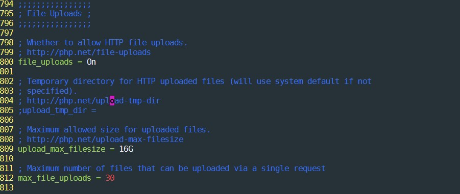
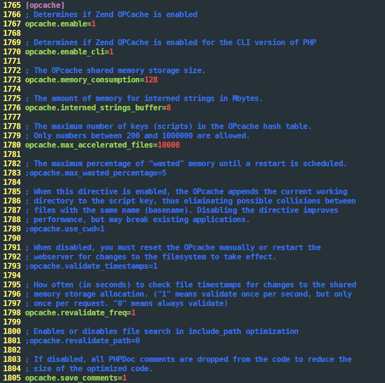

# How to Create a cloud server With NextCloud and LAMP Stack Web Server 

### Before Reading
I am not an expert. This is not finished yet. There are something I still couldn't figure out. I am just trying by myself. I have searched a lot but didn't found a single information how to do it. I didn't found much resource for Tinkerboard, but there is a lot of resource for Raspberry Pi. I chose Tinkerboard because of its extended RAM and CPU. I will update if I discover anything.

## Choosing OS
I have chosen [Armbian Stretch](https://www.armbian.com/tinkerboard/) which is a very lightweight OS and a __Debian based__ linux system. Since I am going to use a headless server, I strongly recommend this OS. I always had issue with TinkerOS. I don't why everytime I tried to update my distro it gives me issues. I like its `armbian config` where you can just simply type `sudo armbian-config`and you can easily configure from the terminal. For more infor you can visit [Armbian Doc](https://docs.armbian.com/) to get started.

## Samba
[Samba](https://www.samba.org) is a file sharing system when you are within the same wifi/network. You can create a network on you system. Installation is very easy. Here is the [full and easy instruction](https://tutorials.ubuntu.com/tutorial/install-and-configure-samba#0). Even though it is a Ubuntu link but it works since it uses debian system. I saw some videos where people says **WORKGROUP** has to be same as current Desktop's **WORKGROUP**, you don't need to do that. Simply add you network location with the `ip_address` Something I just want to add:
- Start `$ sudo /etc/init.d/smbd start`
- Stop `$ sudo /etc/init.d/smbd stop`
- Restart `$ sudo /etc/init.d/smbd restart`
- Configure `sudo vi /etc/samba/smb.conf` go to the bottom of the line and add the following:
```
         [harddrive] (your choice)
         comment = Hard Disk Western Digital (your choice)
         path = /media/mycloud (the path you want to share)
         readonly = no
         browsable = yes (if you want to read and write)
```

## Installing LAMP Stack
- I had an issue with installing php version 7.2 with debian 9. Then I found this [link](https://tecadmin.net/install-php-debian-9-stretch/). I had to import package signing key by entering this:
```
$ sudo apt install ca-certificates apt-transport-https 
$ wget -q https://packages.sury.org/php/apt.gpg -O- | sudo apt-key add -
$ echo "deb https://packages.sury.org/php/ stretch main" | sudo tee /etc/apt/sources.list.d/php.list
```

## Webmin (Optional)
Then I actually wanted to instal Webmin. Webmin is a dashboard where you can configurey things for your server such as file manager, editing samba file sharing system, monitoring your system and make your life very easier. The installation process are [here](http://www.webmin.com/deb.html) and see **Using the Webmin APT repository**
But I have had an issue when installing its dependency `apt-get-versions`. When I tried to install I got this error:
```
** initializing cache. This may take a while **
Error: No information about packages! (Maybe no deb entries?)
dpkg: error processing package apt-show-versions (--configure):
 subprocess installed post-installation script returned error exit status 255
Errors were encountered while processing:
 apt-show-versions
E: Sub-process /usr/bin/dpkg returned an error code (1)

```
Then I found the solution from [this link](https://askubuntu.com/questions/916199/install-apt-show-versions-inside-an-ubuntu-docker-container)
All you just have to do the following.(#):

```
# rm /etc/apt/apt.conf.d/docker-gzip-indexes
# apt-get purge apt-show-versions
# rm /var/lib/apt/lists/*lz4
# apt-get -o Acquire::GzipIndexes=false update

```
After that I tried to install `apt-show-versions` by the following command:
```
# apt-get install apt-show-versions
```
Then All you just have to type `your_ip:10000` and sign in with your username and password that has **root previliges**.

## PHPMyAdmin
Installing LAMP Stack is easy, but activating PHPMyAdmin I found some difficulties. It keep saying missing. So I just want to keep all my solutions here.
- First install some dependencies: 
```               
               $ sudo apt-get install php-mbstring php7.0-mbstring php-gettext libapache2-mod-php7.0
```
- restart `apache2` and `mysql`
  - `sudo /etc/init.d/apache2 restart`
  - `sudo /etc/init.d/mysql restart`
- Then link in `/var/www` like this: `$ sudo ln -s /usr/share/phpmyadmin /var/www/`
- Open apache.conf using your favorite editor, mine is vim: `sudo vim /etc/apache2/apache2.conf`

Then add the following line: `Include /etc/phpmyadmin/apache.conf`

- Then
```
$ sudo ln -s /etc/phpmyadmin/apache.conf /etc/apache2/conf-available/phpmyadmin.conf
$ sudo a2enconf phpmyadmin.conf
$ sudo service apache2 reload
```

**For reference** [PHP1](https://stackoverflow.com/questions/10769148/extension-mysqli-is-missing-phpmyadmin-doesnt-work) [PHP2](https://askubuntu.com/questions/387062/how-to-solve-the-phpmyadmin-not-found-issue-after-upgrading-php-and-apache)
## NextCloud

### NextCloudPi
I find installing NextCloudPi easier that installing NextCloud manually. When I run the following command:
```
# curl -sSL https://raw.githubusercontent.com/nextcloud/nextcloudpi/master/install.sh | bash
```
This will install LAMP stack and automatically configure the process but I don't know if it right or not because I also want to use this server as a web server too. So its tempting. I am still gonna use this.


### Without NextCloudPi
Installing without NextCloudPi is pretty hard but still I wanted to do that because I can't browse web after installing NextCloudPi.
I found a better instruction in [youtube](https://www.youtube.com/watch?v=oIYg2O_ilbw), this works for me. That is the problem. Here are some instructions:

- I tried to installed with snap package, which you can install via `sudo apt install snapd`
- Here is the [documentation](https://docs.nextcloud.com/server/14/admin_manual/installation/source_installation.html#) for that
- **Very Importnat**: You have to create a `/etc/apache2/sites-available/nextcloud.conf` file with these lines in it:
```
Alias /nextcloud "/var/www/nextcloud/"

<Directory /var/www/nextcloud/>
  Options +FollowSymlinks
  AllowOverride All

 <IfModule mod_dav.c>
  Dav off
 </IfModule>

 SetEnv HOME /var/www/nextcloud
 SetEnv HTTP_HOME /var/www/nextcloud

</Directory>
```
- I need to config my Virtual host something like this for nextcloud since I wanted to use it as different subdomain `mycloud.example.com`. To config this I add the following on `/etc/apache2/sites-available/nextcloud.conf`:
```
<VirtualHost *:80>
    ServerAdmin admin@example.com
    ServerName mycloud.example.com
    DocumentRoot /var/www/nextcloud
    ErrorLog ${APACHE_LOG_DIR}/error.log
    CustomLog ${APACHE_LOG_DIR}/access.log combined
</VirtualHost>
```
- __increasing the Upload Size:__ To increase the upload size you have configure in both `php.ini` in you main php config and `.htaccess` in `/var/www/nextcloud` Here is [the documentation](https://docs.nextcloud.com/server/15/admin_manual/configuration_files/big_file_upload_configuration.html?highlight=limit). In documentation, it doesn't show how to configure in php, so I took a screenshot.

- **Eliminate Security & setup Warning**: To fix the issue for OPcache, here is the [documentation](https://docs.nextcloud.com/server/15/admin_manual/configuration_server/server_tuning.html#enable-php-opcache)
      
- **BigInt**: [documentation](https://docs.nextcloud.com/server/15/admin_manual/configuration_database/bigint_identifiers.html)
- **HTTPS STRICT** [Documentation](https://docs.nextcloud.com/server/15/admin_manual/configuration_server/harden_server.html#enable-http-strict-transport-security)

### Some Notes

- When I tried to format my hard disk for keeping the nextcloud data I could not do it via browser I actually had to it via `ncp-config`

### Docker
I don't know much about docker but I couldn't install via `armbian-config`. I tried to install via 

```
# curl -sSL https://get.docker.com | sh
```
## Partioning and format Drive
Using Linux CLI, we can format our drive in any format using `fdisk`. 
- First check that you disk has been recognized. To check that simply type:
```
# fdisk -l
Disk /dev/zram4: 250.8 MiB, 262959104 bytes, 64199 sectors
Units: sectors of 1 * 4096 = 4096 bytes
Sector size (logical/physical): 4096 bytes / 4096 bytes
I/O size (minimum/optimal): 4096 bytes / 4096 bytes


Disk /dev/sda: 477 GiB, 512110190592 bytes, 1000215216 sectors
Units: sectors of 1 * 512 = 512 bytes
Sector size (logical/physical): 512 bytes / 512 bytes
I/O size (minimum/optimal): 512 bytes / 512 bytes
Disklabel type: gpt
Disk identifier: 064B8616-86EE-485B-8BA5-0B2BE95DA67F

Device     Start        End    Sectors  Size Type
/dev/sda1   2048 1000215182 1000213135  477G Linux filesystem
```
If you see something like `/dev/sda1`, it means you already have partition. If you want to delete the partition, you have to do the following:
```
# fdisk dev/sda
Command (m for help): d
```
- We're not finished yet. Now we are going to create a partition
```
Command (m for help): n
Select (default p): p
Partition number (1-4, default 1): 1
First sector (starting-ending, default starting): starting
Last sector, +sectors or +size{K,M,G} (starting-ending, default ending): ending
Command (m for help): w
```
on `starting` and `ending` there will be numbers. Here I just have created the whole disk as one partition. You can adjust the number to make more than one partition.
- You will then need to format using `mkfs`. 
  - If you want to format in `ext3` or `ext4`:
  ```
  # mkfs.ext4 /dev/sda1
  ```
  - If you want to format in `ntfs`:
  ```
  # mkfs.ntfs /dev/sda1
  ```
  - If you want to format `fat`:
  ```
  # mkfs.vfat /dev/sda1
  ```
For future [reference](https://unix.stackexchange.com/questions/185382/how-to-create-a-new-partitioning-table-on-sd-card-from-the-command-line)
## Let's Encrypt
It provides free SSL Certificate for your domain [Certbot's website](https://certbot.eff.org/lets-encrypt/debianstretch-apache) explains a lot about this. This website is very usefull how to encrypt the website. I wanted to use SSL with cloudflare. Certbot has a plugin to do that.
- first you have to install the cloudflare plugin for certbot:
```
# apt install python3-pip
# pip3 install certbot-dns-cloudflare
```
- **Now this part is very important**. Since we're going to use CloudFlare's DNS to verify our domain for Let's Encrypt, Certbot will need to use CloudFlare's API to create some verification DNS records on the fly. To get the API key, you need to login you CloudFlare dashboard, go to you profile and at the bottom, you need to click "View" next to "Global API key". This key is more than a password. If anyone use it, they don't need even two factor authentication. Now, store this credentials on your server, in a file that is readable by root only. I have stored them in `/root/.secrets/cloudflare.ini`
  - The directory should only be accessible by root:
  ```
  $ sudo chmod 0700 /root/.secrets/
  ```
  - The files too:
  ```
  $ sudo chmod 0400 /root/.secrets/cloudflare.ini
  ```
  - Now replace the email address and API key with your email address and API associated with your CloudFlare:
  ```
  dns_cloudflare_email = "youremail@example.com"
  dns_cloudflare_api_key = "4003c330b45f4fbcab420eaf66b4c5cbcab4"
  ```

- To obtain a certificate:
```
# certbot -i apache --dns-cloudflare --dns-cloudflare-credentials ~/.secrets/cloudflare.ini --dns-cloudflare-propagation-seconds 60 -d example.com -d "*.example.com" --server https://acme-v02.api.letsencrypt.org/directory
```
Please choose the option carefully specially when says redirect to 
## Linking with Domain
First, I open port 80 and 443 in my router and also reserve a fix internal IP address and I configure that in my router. So far I have got some solutions of this:
- I created a conf file and have added the following:
```
<VirtualHost *:80>
    ServerAdmin admin@webjenie.com
    ServerName webjenie.com
    ServerAlias www.webjenie.com
    DocumentRoot /var/www/html
    ErrorLog ${APACHE_LOG_DIR}/error.log
    CustomLog ${APACHE_LOG_DIR}/access.log combined
</VirtualHost>
```
- Enabling the New Virtual Host Files
  - Activate the site:
  ```
  $ sudo a2ensite example.com.conf
  ```
  - Disabling the the default site defined in `000-default.conf`
  ```
  $ sudo a2dissite 000-default.conf
  ```
  - restart Apache:
  ```
  $ sudo systemctl restart apache2
  ```
For reference: [1](https://www.digitalocean.com/community/tutorials/how-to-set-up-apache-virtual-hosts-on-debian-8)
  
